---
# pandoc -t beamer --include-in-header=./style.tex presentation.md -o presentation.pdf
title: | 
  	   | Apprenticeship report and Memoire
	   | Topic extraction from customer call logs using word embeddings and clustering techniques
author: \textbf{Khang Duy LAI} \newline Apprenticeship supervisor \textbf{Romain DADEN} \newline Academic tutor \textbf{Kim NGUYEN}
institute: "Université Paris-Saclay"
# topic: "Pandoc how-to"
theme: "CambridgeUS"
colortheme: "orchid"
# fonttheme: "professionalfonts"
# mainfont: "Hack Nerd Font"
# fontsize: 11pt
urlcolor: red
linkstyle: bold
aspectratio: 169
# titlegraphic: 2.jpeg
# logo: 0.png
date: 4/9/2023
section-titles: false
toc: true
navigation: horizontal
---

# Company introduction
## Sector of activity

- SFR stands for Société française du radiotéléphone.
- A French telecommunications company.
- The second oldest mobile network and telecommunications company in France.

## Sector of activity

### Main business sectors

- Mobile services
- Fixed-line services
- Internet services
- Television services

\pause

###

- Business to consumer
- Business to business


## Application of data in business operation

Data is the most valuable asset for businesses, help to improve operational efficiency, marketing and advertising, optimize pricing, etc.

-> SFR Analytics department is responsible to collect, analyze and draw company's vision.


### Organization

- Data science team
- Data analyst team
- Data governance team 

\pause

### Team's main missions

- Reducing churn rate.
- Image processing for infrastructure optimization.
- Customer's feedback analysis.
- Predictive analytics for business management.

# Missions

## Roles

- One of the member of the **data science** team.
- Contribute to the company’s datadriven decision-making processes and strategic initiatives.
- Extracting valuable insights from the vast volumes of data generated within the telecommunications landscape.
- Forcast future situation using machine learning and deep learning techniques.
- Automate some manual tasks.

\pause

### Some of the projects in charge

- Fiber distribution point fake and near-duplicated images detection.
- Research of moving team's infrastructure to Google Cloud.
- Topic extraction from customer call logs using word embeddings and clustering techniques.

# Fiber distribution point fake and near-duplicated images detection

## Fiber distribution point fake and near-duplicated images detection

- A fiber distribution point (PM) is a technical cabinet.
- Operators have a network of PMs. \pause
- The system is shared between operators to reduce cost. \pause
- Outsourcing the maintenant works to other company. \pause
	- Required to capture the image of the PM after finish works.
	- Some forgery images have been sent to the system. \pause
		- Slightly rotate the image
		- Add into the image a color bar or put it inside a color box
		- Cropped
		- Color shift

## Fiber distribution point fake and near-duplicated images detection

::: columns

:::: {.column width=30%}

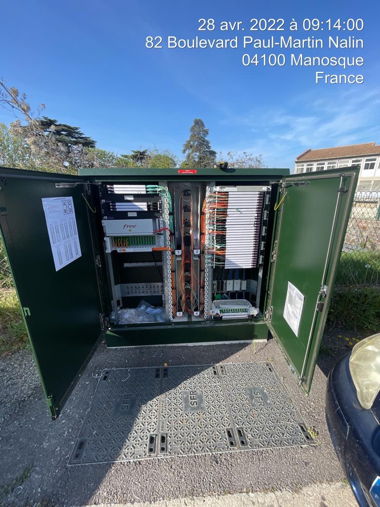{height=80%}

::::

:::: {.column width=30%}

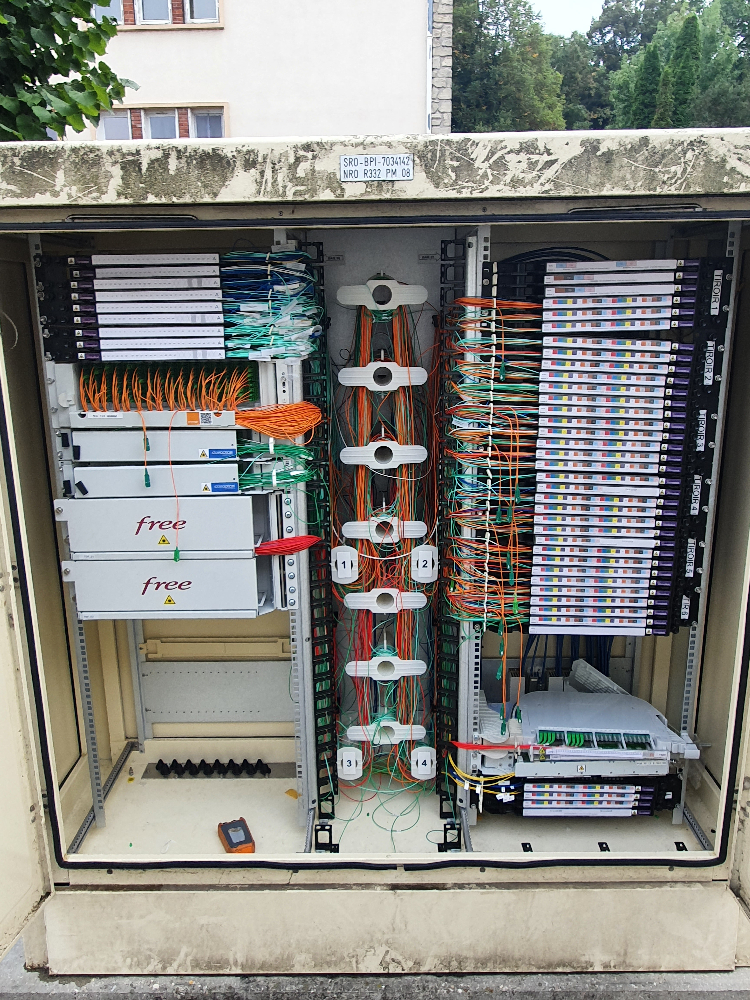{height=80%}

::::

:::: {.column width=30%}

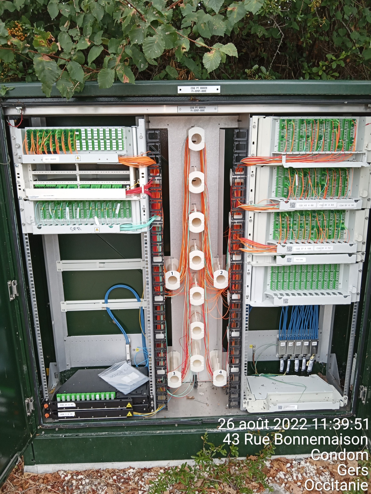{height=80%}

::::

:::


## Fiber distribution point fake and near-duplicated images detection

The system right now using image fingerprint (Perceptual hashing) to detect forgery image.

The accuracy using this system is more than 90%. 

\pause

### Objective

- Deploy a supplement forgery detection system for that 10% inaccuracy. 

## Forgery case example

::: columns

:::: {.column width=50%}

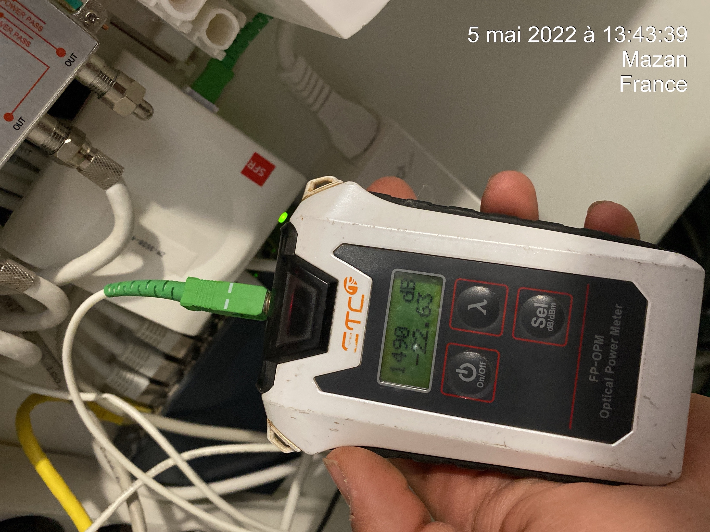{height=80%}

::::

:::: {.column width=50%}

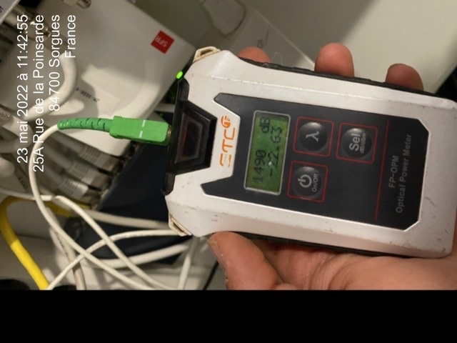{height=80%}

::::

:::

## False positive case example

::: columns

:::: {.column width=40%}

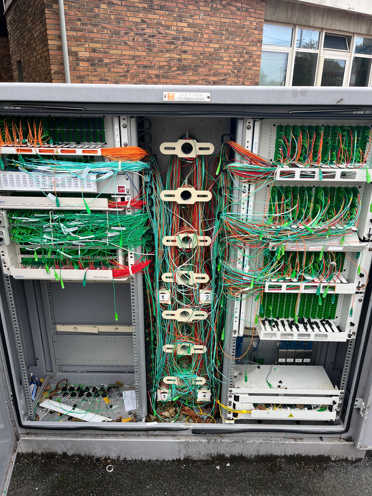{height=80%}

::::

:::: {.column width=40%}

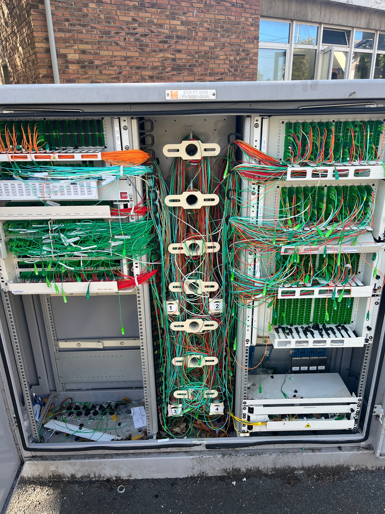{height=80%}

::::

:::

## Methods

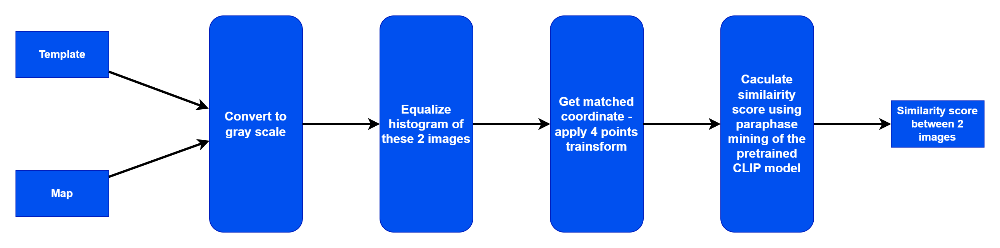


## Result

::: columns

:::: {.column width=50%}

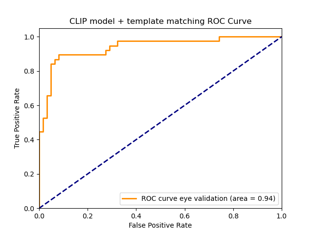{height=80%}

::::

:::: {.column width=50%}

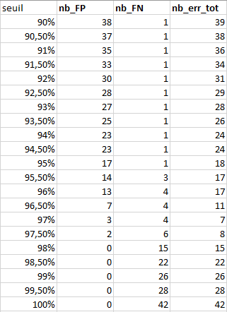{height=80%}

::::

:::

## Result

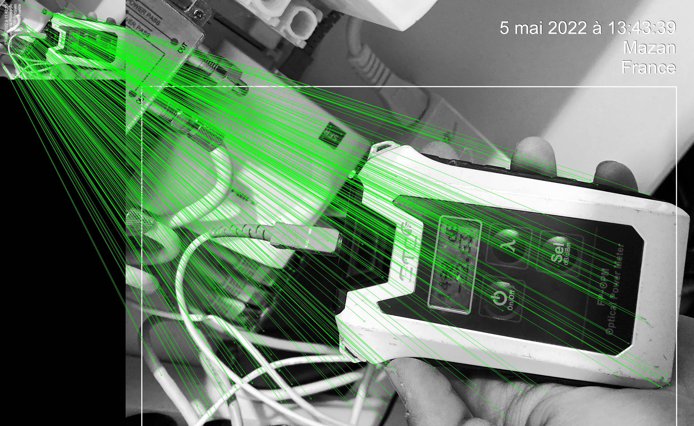{height=80%}


# Cloud migration in SFR Analytics

## Cloud migration in SFR Analytics

Current system of the team is based on self hosted server.

\pause

### Have many drawbacks
- Need to maintain ourself and regularly update.
	- Maintainance complexity is high.
- Hard to scale.
- High cost.

\pause

### Solution

Research to migrate to the cloud.

- The company has 6 months trial contract with Google.

## Cloud migration in SFR Analytics

**Role:** Research usage of VertexAI, a platform designed to help organizations build, deploy, and manage machine learning models at scale.

### Current system
- R script automation using Airflow.
- The system has shown not so reliable.

### Proposed system

- Apply MLOps on models management using VertexAI.

## Cloud migration in SFR Analytics

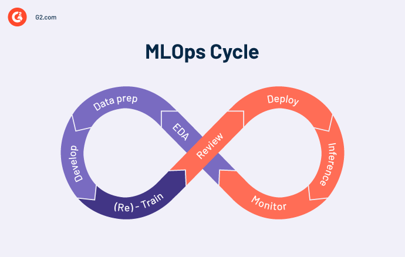{height=60%}

## Cloud migration in SFR Analytics

Researchs

- Vertex AI workbench to work direcly on the cloud.
- Run custom models.
- Work with other GCP services.
	- For example, create dataset from Google Big Querry
- Create custom docker images for training.
- Run custom evaluation.

## Cloud migration in SFR Analytics

Propose accepted. 

- The migration will begin and starting from November 2023.
- Sad not to be the member who participate in the real migration.

<!-- # Memoire -->

# Topic extraction from customer call logs using word embeddings and clustering techniques

## Introduction

::: columns

:::: {.column width=50%}

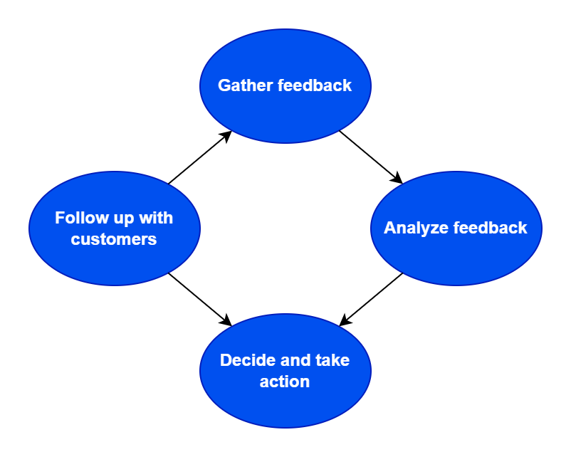{height=80%}

::::

:::: {.column width=50%}

- Ensuring customer satisfaction stands as one of the most important goals for enterprises across industries.
- The collection and analysis of invaluable data derived from customer interactions is the key to improving companies’ competitive advantage.
- Call logs is one of the valuable data to improve customer sastifaction.

\pause

### Objective

The necessary to find topics, which is the significant problems that customers are facing to improve overall quality of the service.


::::

:::

## Dataset

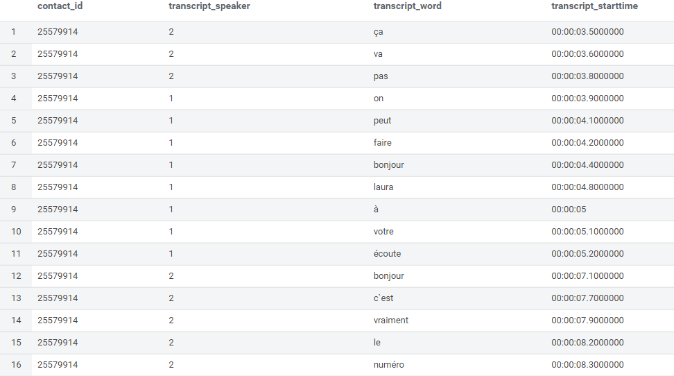{height=80%}

## Dataset

- Need to sign a special permission to have access.
- Final result is to have the acquired conversation in order.
- SQL query orderby ```transcript_starttime```, ```contact-id``` and ```transcript_speaker```.

## Architechture

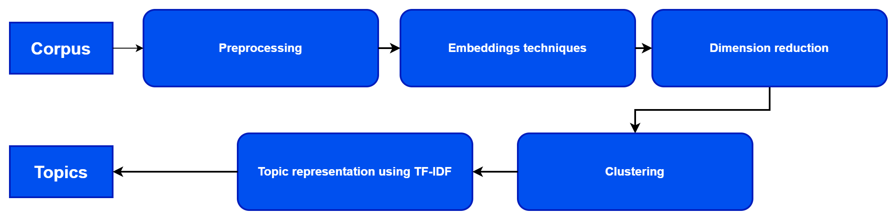

## Data preprocessing

- It is not recommended to clean the corpus before apply embeddings method.
- The dataset acquired is the transcription of conversations.
- Have many filler words.

\pause

###

```
filler_word = [’redacted’, ’bonjour’, ’oui’, ’monsieur’, ’madame’, 
’ben’, ’quelque’, ’moment’, ’justement’, ’euh’, ’non’, ’hein’, 
’collègue’, ’hein’, ’allô’, ’ah’, ’alors’, ’voilà’, ’bah’]
```

## Data preprocessing

- **Original:** oui monsieur bonjour j'ai un problème avec ma ligne fixe euh je le note oui oui oui oui oui c'est-à-dire que je je n'arrive pas à téléphoner que vous avez un numéro mais ça sera pas ça donne rien du tout sais plus comment j'ai pas compris monsieur je vais vous dire depuis au moins 3 ou 4 jours alors j'avais une personne chez vous qui m'a dit que y'avait un problème sur le réseau que ça allait être solutionné mais en fin de compte j'avais pas du tout oui à londres...
- **Hard clean:** j'ai problème ligne fixe note c'est-à-dire n'arrive téléphoner numéro ça ça donne rien tout sais plus comment j'ai compris vais dire depuis moins jours j'avais personne chez m'a dit y'avait problème réseau ça allait être solutionné fin compte j'avais tout londres...
- **Soft clean:** j'ai un problème avec ma ligne fixe je le note c'est-à-dire que je je n'arrive pas téléphoner que vous avez un numéro mais ça sera pas ça donne rien du tout sais plus comment j'ai pas compris je vais vous dire depuis au moins ou jours j'avais une personne chez vous qui m'a dit que y'avait un problème sur le réseau que ça allait être solutionné mais en fin de compte j'avais pas du tout londres...

## Documents embeddings

2 methods of sentence transformer:

- CamemBERT (768 dimensions)
- miniLMv2 multilangual (384 dimensions)

## Dimension reduction

2 methods:

- PCA with 80% of variance
	- Primarily used for linear dimensionality reduction
- UMAP - enhanced method from T-SNE
	- A nonlinear dimensionality reduction technique that focuses on preserving the pairwise similarities between data points
	- UMAP is faster than T-SNE


## Clustering

3 methods:

- Kmeans
- HDBSCAN
- Hierarchy clustering

## Word extraction

We need to use a modified version of TF-IDF.

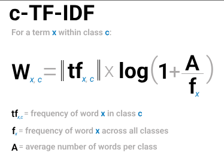{height=50%}

## Results - CamemBERT

::: columns

:::: {.column width=50%}

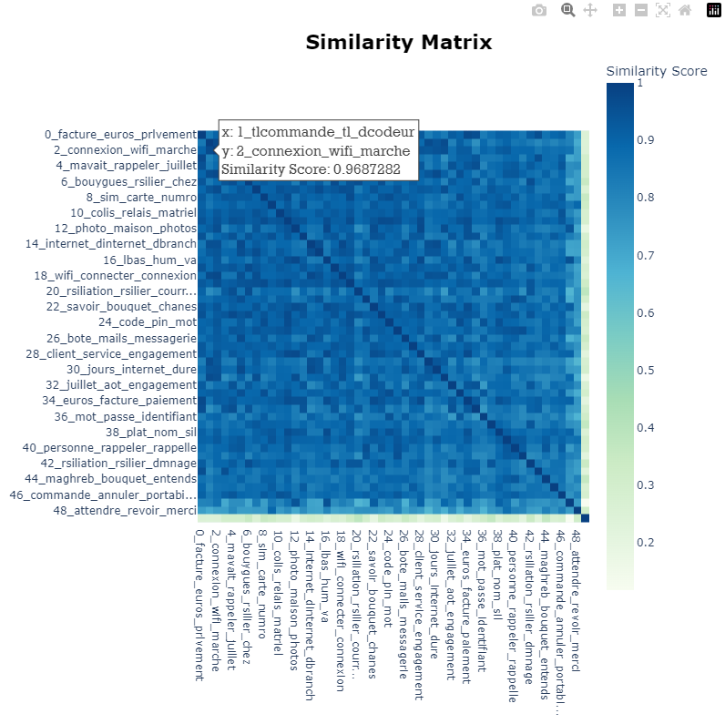{height=60%}

::::

:::: {.column width=50%}

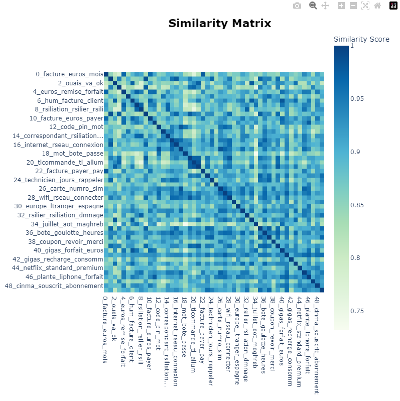{height=60%}

::::

:::

## Results - MiniLMv2

::: columns

:::: {.column width=50%}

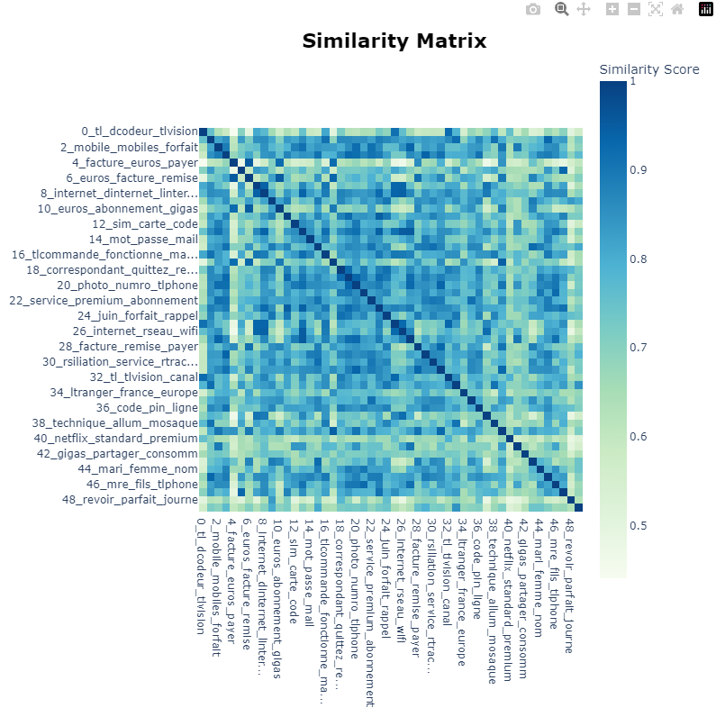{height=60%}

::::

:::: {.column width=50%}

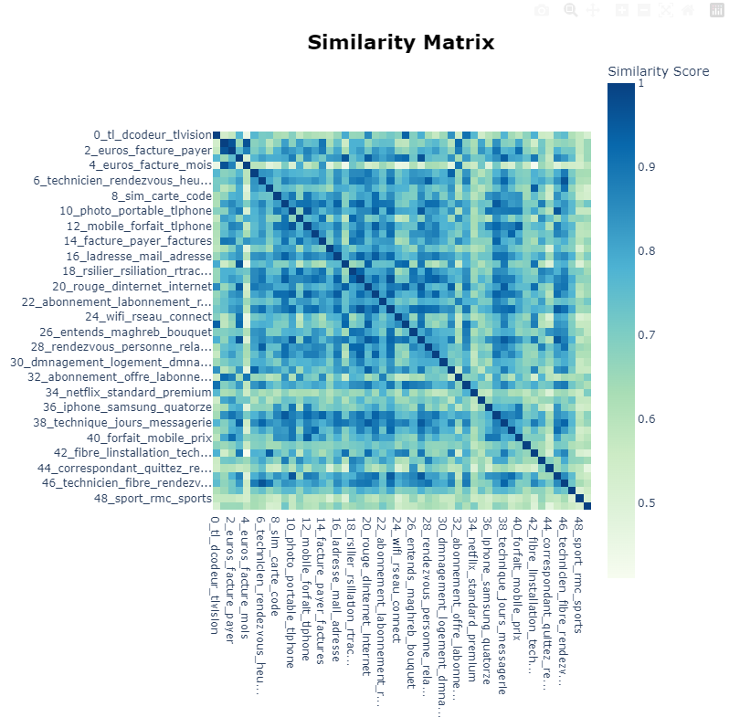{height=60%}

::::

:::

## Results

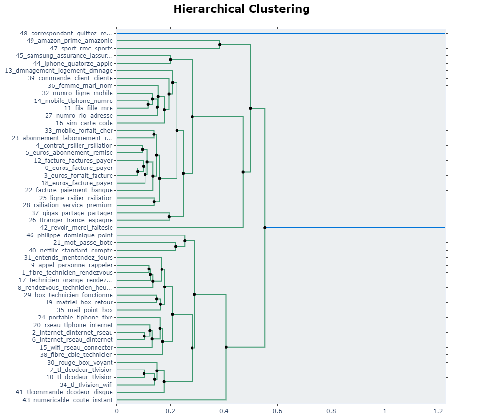{height=80%}

## Future works

We can see the topics of the call in most of techniques, however, there are still works to do.

- Hyperparameter tuning.
- Build an API to return suggested words.

# Conclusion

## Memoire

- Can see the needed topics with the result match the prediction before.
- MiniLM tends to have better performance than CamemBERT, and it is also much faster to inference.
- HDBSCAN works not very good with PCA, presume to be some pairwise similaries between data points have been lost.

## Appenticeship duration

The apprenticeship offers a valuable opportunity for me to improve my skills, and a chance to apply what I have learned over the courses at the university on real projects.


<!-- # Thank you for listening! -->


<!-- # General information

## Themes, fonts, etc.

- I use default **pandoc** themes. \pause
- This presentation is made with **Frankfurt** theme and **beaver** color theme. \pause
- I like **professionalfonts** font scheme. 

## Links

- Matrix of beamer themes: [https://hartwork.org/beamer-theme-matrix/](https://hartwork.org/beamer-theme-matrix/)
- Font themes: [http://www.deic.uab.es/~iblanes/beamer_gallery/index_by_font.html](http://www.deic.uab.es/~iblanes/beamer_gallery/index_by_font.html)
- Nerd Fonts: [https://nerdfonts.com](https://nerdfonts.com)

# Formatting
## Text formatting

Normal text.
*Italic text* and **bold text**.
~~Strike out~~ is supported.

## Notes

> This is a note.
> > Nested notes are not supported.
> And it continues.

## Blocks

### This is a block A

- Line A
- Line B

### 

New block without header.

### This is a block B.

- Line C
- Line D

## Listings

Listings out of the block.

```sh
#!/bin/bash
echo "Hello world!"
echo "line"
```
### Listings in the block.

```sh
#!/bin/bash
echo "Hello world!"
echo "line"
```

## Table

**Item** | **Description** | **Q-ty**
:--------|-----------------:|:---:
Item A | Item A description | 2
Item B | Item B description | 5
Item C | N/A | 100

## Single picture 

This is how we insert picture. Caption is produced automatically from the alt text.

```
 
```

 

## Two or more pictures in a raw

Here are two pictures in the raw. We can also change two pictures size (height or width).

###
```
{height=10%}\ {height=30%} 
```

{ height=10% }\ { height=30% }

## Lists

1. Idea 1
2. Idea 2
	- genius idea A
	- more genius 2
3. Conclusion


## Two columns of equal width

::: columns

:::: column

Left column text.

Another text line.

::::

:::: column

- Item 1.
- Item 2.
- Item 3.

::::

:::

## Two columns of with 40:60 split

::: columns

:::: {.column width=40%}

Left column text.

Another text line.

::::

:::: {.column width=60%}

- Item 1.
- Item 2.
- Item 3.

::::

:::

## Three columns with equal split

::: columns

:::: column

Left column text.

Another text line.

::::

:::: column

Middle column list:

1. Item 1.
2. Item 2.

::::

:::: column

Right column list:

- Item 1.
- Item 2.

::::

:::

## Three columns with 30:40:30 split

::: columns

:::: {.column width=30%}

Left column text.

Another text line.

::::

:::: {.column width=30%}

Middle column list:

1. Item 1.
2. Item 2.

::::

:::: {.column width=30%}

Right column list:

- Item 1.
- Item 2.

::::

:::

## Two columns: image and text

::: columns

:::: column

{height=50%}

::::

:::: column

Text in the right column.  

List from the right column:

- Item 1.
- Item 2.
::::

:::

## Two columns: image and table

::: columns

:::: column

{height=50%}

::::

:::: column

| **Item** | **Option** |
|:---------|:----------:|
| Item 1   | Option 1   |
| Item 2   | Option 2   |

::::

:::

## Fancy layout

### Proposal

- Point A
- Point B

::: columns

:::: column

### Pros

- Good
- Better
- Best

::::

:::: column

### Cons

- Bad
- Worse
- Worst

::::

:::

### Conclusion

- Let's go for it!
- No way we go for it! -->